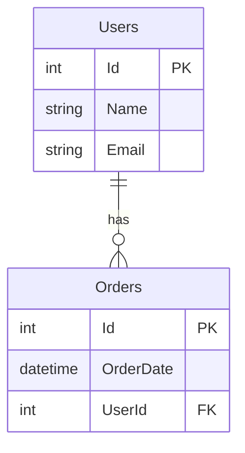

# Candidate Test

## Ordering System Data Structure

Below is an entity relationship diagram using Mermaid syntax that represents a simple e-commerce system with Users, Products, Orders, and OrderLines.
If your IDE does not support Mermaid syntax, you can use an [online Mermaid live editor](https://mermaid-js.github.io/mermaid-live-editor/) to visualize the diagram.

